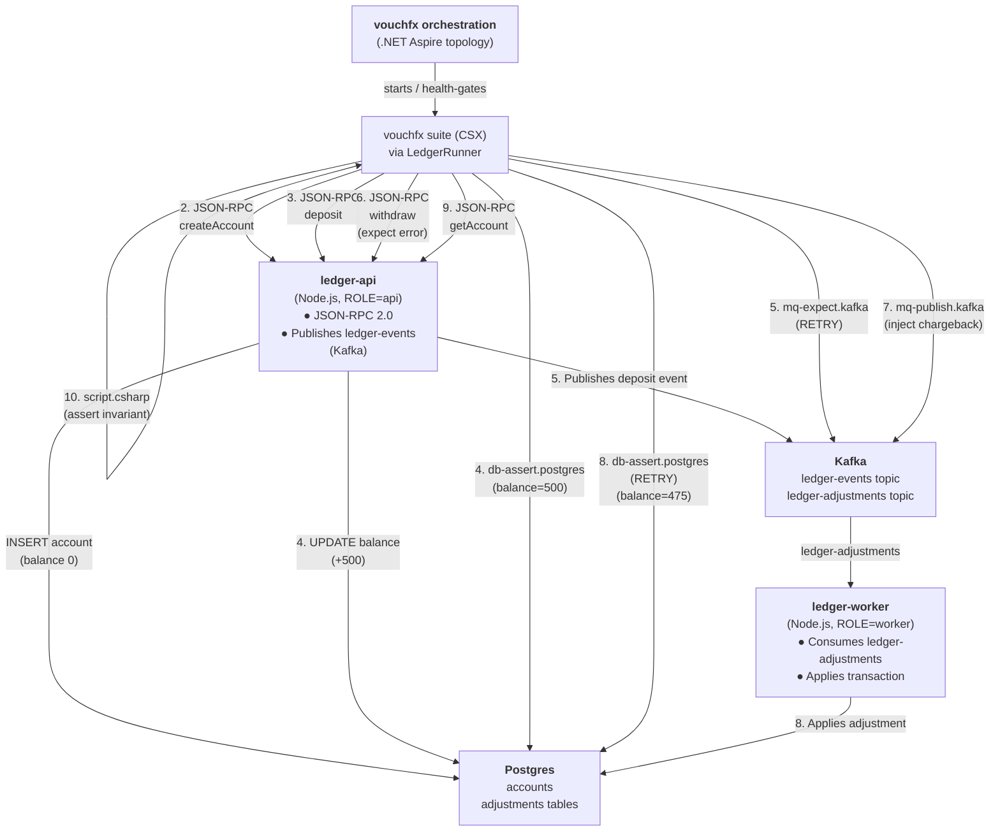

# ledger-jsonrpc

A vouchfx sample proving the engine can orchestrate and test a polyglot system consuming
**Community-tier providers** from the [vouchfx-providers](https://github.com/tomas-rampas/vouchfx-providers)
hub. The service here is a hand-rolled JSON-RPC 2.0 ledger API (Node.js); the suite exercises
REST calls, database rows, broker events, and independent consumer workflows — all wired through
a **custom runner** that the stock `vouchfx` engine CLI cannot run, because the CLI ships only
the frozen Core provider catalogue.

## What this demonstrates

**Four important firsts for vouchfx:**

1. **First sample consuming a Community provider** — `rpc.json-rpc` (the
   [`Vouchfx.Community.JsonRpc`](https://www.nuget.org/packages/Vouchfx.Community.JsonRpc)
   NuGet package from [vouchfx-providers](https://github.com/tomas-rampas/vouchfx-providers))
   is not in the engine's frozen Core set; the stock CLI cannot load it. This sample shows the
   **reference pattern** for anyone who needs to consume hub providers before a provider-loader
   milestone: build a thin custom runner.

2. **First sample using `mq-publish.kafka`** — unlike `mq-expect.kafka` (which *asserts* an
   event exists), `mq-publish.kafka` lets the suite itself *inject* test data onto a broker.
   The suite here uses it to bypass the JSON-RPC surface entirely, feeding the worker role a
   message directly and proving it independently consumes and writes to the database.

3. **First sample using `script.csharp`** — a short C# snippet bridges an engine-staged variable
   name (which contains forbidden characters) into a placeholder-safe name that later steps
   reference. A workaround, but also a genuine feature: authors can run arbitrary C# assertions
   between steps.

4. **First multi-service sample** — the topology contains two containers from one image, each
   selecting a different role via the `ROLE` environment variable. The suite exercises both
   independently and proves they coordinate via the broker.

The sample is also the **first real demonstration** of a distributed business transaction that
isn't a CRUD read-back: a REST call triggers a database write *and* an asynchronous workflow
(Kafka consumer → second write) that the REST surface doesn't orchestrate directly. vouchfx sees
the whole story end-to-end.

## Architecture



Both `ledger-api` and `ledger-worker` run as ordinary containers (`environment.services`);
Postgres and Kafka run as vouchfx-managed Aspire dependencies (`environment.dependencies`).
The two containers share one image but execute different role-specific startup paths selected
by the `ROLE` environment variable — a production pattern the suite proves end-to-end.

## The custom runner: why it exists

The vouchfx engine CLI ships with 25 **Core providers** (frozen at build time for v1.x). The
`rpc.json-rpc` provider in the vouchfx-providers hub is **Community-tier** — maintained outside
the engine, published as an independent NuGet package. Providers are compile-time plugins
(§13 of the [engine blueprint](https://tomas-rampas.github.io/vouchfx/docs/01_Technical_Architecture_and_Engineering_Blueprint.html)),
not runtime-loaded extensions. The stock CLI has no seam to discover or load Community providers.

**The workaround (today's state):** build a custom runner. This project's `runner/` is exactly
that — a ~330-line C# program that:

1. Loads the stock engine's public SDK interfaces (`ScenarioRunner`, `StepKindRegistry`, etc.)
2. References `Vouchfx.Community.JsonRpc` directly via NuGet
3. Constructs a frozen provider registry over the four Core providers this suite needs
   **plus** the Community `rpc.json-rpc` provider
4. Discovers and runs `.e2e.yaml` files against that registry
5. Produces the exact same JUnit XML and HTML reports as the stock CLI

This is the **reference pattern** for anyone consuming hub providers before a provider-loader
feature ships. The runner is minimal but production-grade: it mirrors the engine CLI's
`RunCommand.cs` path exactly, reusing its discovery, parsing, validation, and execution
logic.

**Run it like this:**

```bash
# List every step kind the runner knows about (Community + Core)
dotnet run --project samples/ledger-jsonrpc/runner --list

# Run the suite (run-sample.sh auto-detects the custom runner)
dotnet run --project samples/ledger-jsonrpc/runner -c Release -- \
  samples/ledger-jsonrpc/tests --html out/ledger-report.html --junit out/ledger-results.xml
```

See the **How to run** section below for the production convenience script.

## The app (`app/`)

One Node.js 22 image, dual-role:

| File | Responsibility |
|---|---|
| `src/server.js` | HTTP entrypoint. Selects role via `ROLE` env var, serves `GET /` (readiness), sets up Postgres and Kafka. |
| `src/api.js` | JSON-RPC 2.0 handler (`POST /rpc`): `createAccount`, `deposit`, `withdraw`, `getAccount`. Hand-rolled (not delegated to a library) to show the protocol's rules explicitly. Domain error code: `-32001` (INSUFFICIENT_FUNDS). |
| `src/db.js` | Postgres pool and schema: `accounts` table (id, balance, created_at) and `adjustments` table (id, account_id, delta, reason, applied_at). Reads env vars `PG*` (standard libpq names). |
| `src/kafka.js` | Kafka client, producer (for `ledger-api` role), consumer (for `ledger-worker` role), topic provisioning. Reads `KAFKA_BROKERS` (comma-separated `host:port`). |
| `src/worker.js` | Kafka consumer message processor for `ledger-worker` role: reads `{accountId, delta, reason}`, applies a transactional balance adjustment, logs to the `adjustments` table. |

**Startup contract (health gate):**

- `GET /` answers `503 {"status":"starting"}` until Postgres and Kafka are both provisioned
  (schema created, topics exist) and, for `ROLE=api`, the producer is connected
  (for `ROLE=worker`, the consumer subscription is active).
- Once ready, `GET /` returns `200 {"status":"ready", "role":"<role>"}`.
- If dependencies do not become reachable within 60 seconds, the service logs the failure
  and stays not-ready forever (no crash loop) — the suite's health gate will timeout and
  report EnvironmentError.

**Endpoints:**

`ledger-api` (`ROLE=api`):
- `GET /` — readiness probe (as above).
- `POST /rpc` — JSON-RPC 2.0 request/response. Methods:
  - `createAccount(ownerName: string)` → `{accountId: string}` (new account created with balance 0).
  - `deposit(accountId: string, amount: number)` → `{accountId: string, balance: number}` (balance after deposit).
  - `withdraw(accountId: string, amount: number)` → `{balance: number}`, or error `-32001`
    (insufficient funds) if balance < amount.
  - `getAccount(accountId: string)` → `{accountId: string, balance: number}`, or error `-32004` (account not found).
  
  **Security note:** The JSON-RPC endpoint is deliberately unauthenticated — it is an ephemeral,
  network-isolated test system under test. Do not copy this design to production services.

- Publishes `{"type":"funds.deposited", ...}` to the `ledger-events` Kafka topic after every
  successful `deposit`, and `{"type":"funds.withdrawn", ...}` after every successful `withdraw`.
  (Publication failures are logged and swallowed — the HTTP response already went out, so an
  event-pipeline hiccup must not fail an otherwise successful transaction.)

`ledger-worker` (`ROLE=worker`):
- `GET /` — readiness probe (as above).
- No other HTTP surface. In the background, consumes `ledger-adjustments` Kafka topic
  (consumer group `ledger-worker`), reads `{accountId, delta, reason}` from each message,
  and applies a transactional balance adjustment to the Postgres `accounts` table,
  logging the adjustment to the `adjustments` table.

## The suite (`tests/ledger.e2e.yaml`)

Ten steps, one narrative — "a ledger transaction through REST, database, and an independent
worker consuming a message the suite injects":

### Step 1: `bridge-ledger-url` — `script.csharp`

The orchestrator stages the discovered `ledger-api` service URL at `Vars["svc::ledger-api"]`
before any step runs. But placeholders only match `[A-Za-z_][A-Za-z0-9_]*` (no `:` or `-`),
so `{svc::ledger-api}` cannot be written as a token. This step reads the raw key and copies
it to the underscore-only `Vars["ledger_url"]`, which every later step references.

**GOTCHA:** `dotnet run --project <p>` sets the spawned process's working directory to
`<p>`, not your invoking shell's cwd. Relative paths passed to the runner resolve relative
to the project directory. The YAML comment in `ledger.e2e.yaml` line 16 documents this;
when in doubt, use absolute paths.

### Step 2: `create-account` — `rpc.json-rpc`

Calls `POST {ledger_url}/rpc` with method `createAccount`, params `{ownerName}`. No explicit
`expect` block (the call succeeds if it returns a result) — this step proves the RPC surface
accepts the request. Captures the generated `accountId` for all later steps.

### Step 3: `deposit-funds` — `rpc.json-rpc`

Calls `deposit(accountId, amount=500)`. Expects the returned `balance` to be exactly `500`
(proving the operation succeeded). Later queries and events must show this same balance.

### Step 4: `assert-balance-after-deposit` — `db-assert.postgres`

Queries `SELECT balance FROM accounts WHERE id = @id` and asserts exactly one row with
`balance == "500"`. **Schema note:** the balance column is INTEGER, but `expect.row` declares
every value as a string (the provider reads `ToString()` on the column). Quoting the YAML
value `"500"` is therefore required, not stylistic — an unquoted `500` would fail JSON Schema
validation before the topology even starts.

### Step 5: `assert-deposit-event` — `mq-expect.kafka`

Polls the `ledger-events` topic for a message matching `type == "funds.deposited"` and
`accountId == {captured value}`. Uses `verifyMode: RETRY` (60s budget) because `publishEvent`
in the API runs after the HTTP response returns — the message may not have landed yet.

### Step 6: `withdraw-too-much` — `rpc.json-rpc`

Calls `withdraw(accountId, amount=10000)` where balance is only `500` — a **negative test**.
Expects the response to be a JSON-RPC error envelope with code `-32001` (INSUFFICIENT_FUNDS),
proving the domain rule enforces constraints. The account's balance is untouched.

### Step 7: `publish-chargeback-adjustment` — `mq-publish.kafka`

The suite itself injects a message onto the `ledger-adjustments` Kafka topic: `{accountId,
delta: -25, reason: "chargeback"}`. This bypasses the JSON-RPC surface entirely, targeting
only the worker role's independent consume-and-write path. The payload is a YAML single-quoted
string (starts with `{`, so YAML would parse it as flow-mapping if unquoted) carrying literal
JSON; `{placeholder}` substitution still runs on the resolved text.

### Step 8: `assert-balance-after-adjustment` — `db-assert.postgres`

Queries the balance again, now expecting `475` (`500 - 25`). Uses `verifyMode: RETRY` with
a 90-second budget — the longest of any step. A fresh consumer group joining a broker that only
just became healthy, plus the worker's transactional write, means this step is most likely to
need real polling headroom to succeed.

### Step 9: `get-closing-balance` — `rpc.json-rpc`

Calls `getAccount(accountId)` and captures the returned `balance` into `closing_balance`.
Closes the loop: the whole transaction was REST-initiated, so the suite reads it back the
same way.

### Step 10: `assert-arithmetic-invariant` — `script.csharp`

The final C# assertion: parse `closing_balance` (a JSON text capture, not a native int) and
verify it equals `500 - 25 == 475`. A thrown exception is caught by the framework and recorded
as `Verdict.Fail` (never an unhandled crash).

This step uses `script.csharp`'s `file` field instead of inline `code:` — the body lives in
[`tests/scripts/assert-arithmetic-invariant.csx`](tests/scripts/assert-arithmetic-invariant.csx),
resolved relative to `ledger.e2e.yaml`'s own directory and read once at compile time. Step 1
(`bridge-ledger-url`, above) deliberately keeps its short body inline via `code:`, so the suite
demonstrates both forms side by side. **Note:** `file` requires vouchfx v1.0.0-alpha.5 or later;
this repo's `ENGINE_PIN` (see that file's header) is pinned at or past that commit.

## Provider table

| Family | Provider | Tier | Package (version) | Reference |
|--------|----------|------|-------------------|-----------|
| `rpc` | `json-rpc` | Community | `Vouchfx.Community.JsonRpc` 1.0.0-alpha.1 | [vouchfx-providers](https://github.com/tomas-rampas/vouchfx-providers/tree/main/community/Vouchfx.Community.JsonRpc) |
| `db-assert` | `postgres` | Core | Engine-shipped (pinned via [`ENGINE_PIN`](../../ENGINE_PIN)) | [vouchfx](https://github.com/tomas-rampas/vouchfx) |
| `mq-publish` | `kafka` | Core | Engine-shipped (pinned via [`ENGINE_PIN`](../../ENGINE_PIN)) | [vouchfx](https://github.com/tomas-rampas/vouchfx) |
| `mq-expect` | `kafka` | Core | Engine-shipped (pinned via [`ENGINE_PIN`](../../ENGINE_PIN)) | [vouchfx](https://github.com/tomas-rampas/vouchfx) |
| `script` | `csharp` | Core | Engine-shipped (pinned via [`ENGINE_PIN`](../../ENGINE_PIN)) | [vouchfx](https://github.com/tomas-rampas/vouchfx) |

## Exact provider fields used, and where each was verified

Every field below was checked against the actual provider source in the vouchfx engine repo
and the vouchfx-providers hub (`src/Providers/Core/**/*Provider.cs` and `community/**/*Provider.cs`) — its `SchemaFragment` (the JSON Schema actually enforced) and its emitted-CSX `Emit`/helper logic — not just illustrative examples:

| Step type | Fields used | Verified against |
| --- | --- | --- |
| `rpc.json-rpc` | `url`, `method`, `params`, `expect.result`, `expect.error.code`, `capture` (JSONPath from full envelope) | `Vouchfx.Community.JsonRpc/JsonRpcModel.cs` + `JsonRpcProvider.cs` (vouchfx-providers) — `url` is a literal or `{placeholder}` string (unlike `http.rest` which takes a `target` reference); `params` is a YAML mapping JSON-serialised at compile time with `{placeholder}` tokens resolved at execution time; `expect.result` paths are rooted at the RPC result member (e.g., `$.balance`), whilst `capture` paths are rooted at the full response envelope (e.g., `$.result.balance`) — this asymmetry is documented in the provider's model; error codes are matched ordinally as JSON numbers. |
| `db-assert.postgres` | `target`, `query`, `parameters`, `expect.rowCount`, `expect.row` | `Vouchfx.Steps.DbAssert.Postgres/DbAssertPostgresProvider.cs` — parameter values are bound as Npgsql string parameters (`AddWithValue` on a C# `string`); `expect.row` values are compared via `.ToString()` (ordinal); schema fragment declares every row value as `"type": "string"` (requiring quoted YAML for numeric columns), and at runtime Npgsql's `reader[col].ToString()` is compared ordinally against the declared string value. |
| `mq-expect.kafka` | `target`, `topic`, `verifyMode: RETRY`, `timeout`, `match.json` | `Vouchfx.Steps.MqExpect.Kafka/MqExpectKafkaProvider.cs` — the emitted helper performs one idempotent poll per RETRY attempt from the retained log start; the provider never itself writes `Inconclusive` (the engine's RetryRunner converts a sustained `Fail` to `Inconclusive` on timeout); assumes the topic exists or will be created by the service under test before step execution. |
| `mq-publish.kafka` | `target`, `topic`, `payload` | `Vouchfx.Steps.MqPublish.Kafka/MqPublishKafkaProvider.cs` — `payload` is a literal YAML string (single-quoted to prevent YAML flow-mapping parsing when it starts with `{`); `{placeholder}` tokens inside the payload text are resolved at execution time after YAML parsing, enabling the suite to inject test data directly onto the broker. |
| `script.csharp` | `code` (inline) or `file` (external), `Vars` access (full ambient access, no placeholder-regex restriction) | `Vouchfx.Steps.Script.Csharp/ScriptCsharpProvider.cs` — either `code:` (inline C# snippet) or `file:` (path relative to the `.e2e.yaml` file, resolved at compile time) — mutually exclusive; scripts have full read/write access to the `Vars` dictionary, including keys with special characters (`:`, `-`) that cannot be used in `{placeholder}` tokens; a thrown exception is caught by the framework and recorded as `Verdict.Fail` (never an unhandled crash). |

## Engine contract

This suite exercises the engine's SUT-configuration surface: `environment.services` with dual-role
containers selected via the `ROLE` environment variable, and `${conn:<dependency>.<field>}` placeholder forms (`.host`, `.port`, `.username`, `.password`, `.database` for PostgreSQL; the bare `${conn:broker}` full-URL form for Kafka, which resolves to the internal `host:port`). Both container roles receive identical connection configuration but execute different code paths selected by the `ROLE` variable — a production pattern the suite proves end-to-end. All of it has been validated **live, end-to-end**, against the vouchfx engine commit pinned in [`../../ENGINE_PIN`](../../ENGINE_PIN) — the topology stands up, both `ledger-api` and `ledger-worker` containers receive their `env:` values and connection tokens, the custom runner loads the Community `rpc.json-rpc` provider alongside the Core providers, and all ten suite steps pass against the real containers.

## How to run

This sample runs via its **custom runner**. The everyday path is the same as every other sample — `./scripts/run-sample.sh ledger-jsonrpc` auto-detects `runner/` and uses it — or invoke the runner directly:

```bash
# 1. Fetch and build the pinned engine (one-time, same as other samples)
./scripts/bootstrap.sh

# 2. Build the sample's Docker image
docker build -t vouchfx-samples-ledger-jsonrpc:local samples/ledger-jsonrpc/app

# 3. Run via the custom runner (produces HTML + JUnit reports)
dotnet run --project samples/ledger-jsonrpc/runner -c Release -- \
  samples/ledger-jsonrpc/tests \
  --html out/ledger-report.html \
  --junit out/ledger-results.xml
```

On Windows (PowerShell):

```powershell
.\scripts\bootstrap.ps1

docker build -t vouchfx-samples-ledger-jsonrpc:local samples/ledger-jsonrpc/app

dotnet run --project samples/ledger-jsonrpc/runner -c Release -- `
  samples/ledger-jsonrpc/tests `
  --html out\ledger-report.html `
  --junit out\ledger-results.xml
```

## Expected output

All 10 steps expected to pass in ~40 seconds (depending on topology startup time, which dominates).

Artefact paths (when run via the sample runner or custom runner directly):
- `out/ledger-results.xml` — JUnit XML for IDE/CI integrations
- `out/ledger-report.html` — interactive HTML report with step-by-step timeline, captures, assertions, and error details

### Diagnostic: list registered step kinds

```bash
dotnet run --project samples/ledger-jsonrpc/runner --list
```

This prints every step kind the runner knows (Community + Core) without starting Docker or the
topology — useful to verify the custom runner wired both provider sets correctly. The runner's
list should show 5 step kinds (4 Core + 1 Community) — a custom runner registers only what it
explicitly references, demonstrating the minimal-bundle pattern for hub consumption.

## Troubleshooting

- **`Discovery root ... does not exist` when invoking the runner directly.** `dotnet run --project <p>` sets the spawned process's working directory to `<p>`'s own directory, not the invoking shell's cwd. Paths passed to the runner (the `<tests-dir>` argument, `--junit`, `--html`) are resolved relative to the runner project's directory, not the repo root. Use either: (a) `../tests` (relative from `runner/` up to the sibling `tests/` directory) as shown in this README, or (b) absolute paths — this is what CI does. Avoid paths relative to the repo root (e.g., `samples/ledger-jsonrpc/tests`) as they silently resolve to a nonsense nested path under `runner/` and fail.

- **`rpc.json-rpc` step times out or returns `Inconclusive`.** Confirm the `ledger-api` container is healthy (check `docker logs ledger-api` for startup errors), the container's port is reachable (manually curl `http://localhost:8080/` if you know the mapped port), and the `url:` field exactly matches the discovered service's base URL. The `bridge-ledger-url` step (step 1) must execute before any `rpc.json-rpc` step; if step 1 fails, later steps that reference `{ledger_url}` are starved of a valid value.

- **`assert-balance-after-adjustment` (step 8) times out despite the worker appearing healthy.** This step polls a fresh consumer group joining a broker that only just became healthy (step 7 injected the message onto `ledger-adjustments`). Use `docker logs ledger-worker` to confirm the Kafka consumer is actually connected and the message is being consumed — a connection timeout or consumer group lag would cause this step to timeout even if the database write eventually succeeds. The 90-second budget exists precisely because this step is the most likely to need real polling headroom; if it still times out, check Kafka broker logs (`docker logs broker` or similar) for errors.

- **`mq-expect.kafka` (step 5) or `mq-publish.kafka` (step 7) fails with a topic-not-found error.** The app's Kafka setup must create both the `ledger-events` (for publishing and consuming `funds.deposited` events) and `ledger-adjustments` (for step 7's injected message) topics before any step runs. Check `app/src/kafka.js` to confirm both topics are declared on startup; if either is missing, the app's readiness probe should stay at `503` until Kafka is healthy, and the vouchfx health gate should timeout and report EnvironmentError before any step runs.

- **Script step (step 1 or 10) throws an exception but the suite continues instead of failing.** The `script.csharp` provider catches thrown exceptions and records them as `Verdict.Fail`. Every step always runs regardless of prior verdicts in the current engine; `continueOnFailure` is parsed from the YAML but not yet enforced at execution time. Check that step 1 (`bridge-ledger-url`) actually succeeds; if it throws an exception (e.g., `Vars["svc::ledger-api"]` is null), that exception becomes the step's verdict. If step 1 throws `Fail`, verify the orchestrator actually staged `Vars["svc::ledger-api"]` before any step ran (it should; this is standard engine behaviour — check the engine's `ScenarioRunner.cs` if doubting).

- **`script.csharp` with `file:` field fails with a path error.** The `file:` path is relative to the `.e2e.yaml` file's own directory. If your invocation cwd differs from the .yaml's directory, use an absolute path or a path relative from the .yaml's location. The `bridge-ledger-url` step (step 1) uses inline `code:` deliberately so this suite demonstrates both forms side by side; step 10's `file:` references `tests/scripts/assert-arithmetic-invariant.csx` (relative from `tests/ledger.e2e.yaml`'s location). Verify the file exists at the resolved path before running.

- **`GET /` returns `503 {"status":"starting"}` for both containers indefinitely.** One of the dependencies (Postgres or Kafka) never became reachable within the retry window, or a role-specific startup path failed. Check `docker logs ledger-api` and `docker logs ledger-worker` for connection errors; common causes are wrong hostname/port env vars, a dependency container still pulling its image, or a firewalled Docker network. The vouchfx health gate will timeout and report EnvironmentError if any service stays not-ready beyond 120 seconds.

- **Custom runner build fails: `ProjectReference ... does not exist`.** The runner project references the engine's internal source tree under `.vouchfx-src/`. If that directory is missing or stale, run `./scripts/bootstrap.sh` or `.\scripts\bootstrap.ps1` first to fetch and build the pinned engine commit. The runner's `packages.lock.json` is a recorded manifest (RestoreLockedMode is deliberately not enabled); if it drifts from the actual resolved graph on `dotnet restore`, the lock silently regenerates rather than breaking the build. The real risk when advancing `ENGINE_PIN` is a source-level API mismatch in the ProjectReferences — if the engine tree reorganises, the runner's project paths may no longer exist.

- **`--list` command shows fewer than 5 step kinds.** The custom runner registers only the step kinds it explicitly references (the minimal-bundle pattern). If a provider is not being discovered, check that the runner's source code actually holds a `new StepKindRegistry().With(...)` call for each provider, and that each provider's NuGet package reference is present in the runner's `.csproj` file. The base engine provides the 4 Core providers; only the Community `rpc.json-rpc` needs an explicit reference to `Vouchfx.Community.JsonRpc`.

## Key documents

- **[vouchfx-providers hub](https://tomas-rampas.github.io/vouchfx-providers/)** — Community provider listings and the Vouched badge; see its [consuming-a-provider guide](https://tomas-rampas.github.io/vouchfx-providers/docs/consuming-a-provider.html) for the packaging and pinning rules
- **[Engine blueprint](https://tomas-rampas.github.io/vouchfx/docs/01_Technical_Architecture_and_Engineering_Blueprint.html)**
  — the five-layer design, memory model, §13 provider contract (frozen for v1.x)
- **[YAML DSL specification](https://tomas-rampas.github.io/vouchfx/docs/02_YAML_DSL_Specification_and_VSCode_Extension_Design.html)**
  — `.e2e.yaml` grammar, step families, capture/placeholder syntax
- **[Engine CONTRIBUTING.md](https://github.com/tomas-rampas/vouchfx/blob/main/CONTRIBUTING.md)**
  — how to implement a new provider (source)
