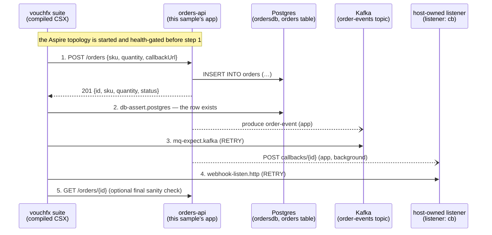

# orders-dotnet

A real ASP.NET Core 8 order-confirmation service, tested end-to-end with
[vouchfx](https://github.com/tomas-rampas/vouchfx): one HTTP request is followed all the way
through a database write, an outbound event, and an outbound webhook callback — in a single
`.e2e.yaml` suite, against a real container topology.

## What this demonstrates

Most "hello world" API samples stop at asserting an HTTP response. Real distributed systems
keep working *after* they answer the request: they write to a database, publish an event other
services react to, and often call back out to whoever asked. A unit test — or a tool that only
speaks HTTP — cannot see any of that. This sample exists to prove vouchfx can:

- drive a **real containerised .NET service** (not a stub) through its public HTTP surface;
- assert a **side-effecting database write** landed correctly, with the row keyed by a value
  captured from the HTTP response;
- assert an **asynchronous Kafka event** was published, via engine-owned RETRY polling (no
  author-written `sleep`);
- assert the service **called back out** over an outbound webhook, captured by a host-owned
  listener — the same shape a real payment gateway / webhook-integrated SaaS callback takes;
- and do all of this from **one coherent business-transaction narrative**, not four disconnected
  checks.

## Architecture



`orders-api` runs as an ordinary container (`environment.services.orders-api`); Postgres and
Kafka run as vouchfx-managed Aspire dependencies (`environment.dependencies`). The webhook
listener is a *host*-owned resource the engine stands up before step 1 runs and hands the app a
callback URL for — there is no listener container in the topology.

## The app (`app/`)

`Orders.Api` — a single-project ASP.NET Core 8 minimal API (`Orders.Api.csproj`), dependencies
`Npgsql` + `Confluent.Kafka` only, configured entirely by environment variables:

| Env var | Purpose |
| --- | --- |
| `ConnectionStrings__orders` | Npgsql connection string for the `orders` database. |
| `KAFKA_BOOTSTRAP` | Kafka bootstrap `host:port`. |

Behaviour:

- **Startup** (`DatabaseInitializer`, a `BackgroundService`): retries the Postgres connection
  for up to ~60 s, then runs `CREATE TABLE IF NOT EXISTS orders(...)` and flips
  `ReadinessState`. `GET /` returns `503 {"status":"starting"}` until that flag is set, then
  `200 {"status":"ready"}` — **this is the exact contract the vouchfx health gate polls** before
  letting any step run.
- **`POST /orders`** `{sku, quantity, callbackUrl?}` → `201 {id, sku, quantity, status:
  "CONFIRMED"}`. Inserts the row, publishes `{id, sku, quantity, status}` (camelCase JSON) to
  the `order-events` Kafka topic and awaits delivery (bounded — see Troubleshooting), and, if
  `callbackUrl` is present, POSTs `{orderId, status:"CONFIRMED"}` to
  `<callbackUrl>/callbacks/<id>` in the background with 5 attempts / 2 s backoff.
- **`GET /orders/{id}`** → `200` row JSON, or `404` (including for a syntactically invalid id —
  the `{id:guid}` route constraint simply does not match, falling through to the default 404).

## The suite (`tests/orders.e2e.yaml`)

Five steps, one narrative — "a customer places an order, and everything downstream reacts":

1. **`place-order`** (`http.rest`, `POST /orders`) — places the order, handing the app
   `{cb_container}` as `callbackUrl` (the host-owned webhook listener's container-reachable
   URL — see "Engine contract" below). Expects `201` and captures `orderId` from the response's
   `$.id`. This proves the REST surface accepted the request and returned the shape the rest of
   the suite depends on.

   **Caveat if you copy this pattern:** `callbackUrl` is caller-supplied and the app POSTs to it
   unchecked — a deliberate demo-grade SSRF surface that keeps this sample simple. Do not carry
   that shape into production without an allowlist (or another way of constraining which hosts
   the service will call back to).
2. **`assert-order-row`** (`db-assert.postgres`, target `ordersdb`) — proves the `POST` really
   persisted a row, not just a 201 with no side effect: queries `WHERE id = @id::uuid` (see
   "Engine contract" for the cast) with `{orderId}` substituted in as the parameter value, and
   asserts `rowCount: 1` and `row: {sku: WIDGET-1, status: CONFIRMED}`.
3. **`assert-order-event`** (`mq-expect.kafka`, target `broker`, topic `order-events`,
   `verifyMode: RETRY`, `timeout: 60s`) — proves the app published the domain event, matching
   `$.id == {orderId}` via `match.json`. RETRY absorbs the small, variable delay between the
   `INSERT` and the event landing — no author-written `sleep`.
4. **`assert-webhook-callback`** (`webhook-listen.http`, `listener: cb`, `verifyMode: RETRY`,
   `timeout: 60s`) — proves the app called back out over the outbound webhook, matching
   `method: POST` and `path: "/callbacks/{orderId}"` against what the host-owned listener
   captured. This is the step that makes the round trip genuinely end-to-end: it isn't enough
   that the app *received* a callback URL in step 1 — this step proves it *used* it.
5. **`refetch-order`** (`http.rest`, `GET /orders/{orderId}`, optional) — a final sanity check
   that the row committed in step 2 is also visible through the app's own read path.

### Design decision: webhook path matching

The app POSTs to `<callbackUrl>/callbacks/<orderId>` (see `app/WebhookNotifier.cs`), and the
suite's `webhook-listen.http` step matches `path: "/callbacks/{orderId}"`. This exact
"`<base>callbacks/<id>`" composition is **deliberately copied from vouchfx's own canonical
reference scenario** (`examples/reference/reference.e2e.yaml`, step `webhook-trigger` /
`webhook-await` in the vouchfx engine repo), for two reasons:

- vouchfx's host-owned listener (`Vouchfx.Engine.Orchestration/HostResources/WebhookListener.cs`)
  embeds an unguessable token as the *first path segment* of the URL it stages
  (`http://<host>:<port>/<token>/`) and strips that segment before exposing the path to
  `match.path` — so authors match the SUT-facing tail (`/callbacks/<id>`) without ever knowing
  the token. The app's `callbackUrl.TrimEnd('/') + "/callbacks/" + orderId` composition is
  robust to whether the staged URL does or doesn't end in `/`, and reproduces the token/tail
  split the listener expects.
- Reusing a pattern the engine's own maintainers already validate live (rather than inventing a
  new one) minimises the odds of a path-matching mismatch that can only be caught once the
  orchestrator actually runs this suite.

## Provider table

| Family | Provider | Tier | Package (version) | Reference |
| --- | --- | --- | --- | --- |
| `http` | `rest` | Core | Engine-shipped (pinned via [`ENGINE_PIN`](../../ENGINE_PIN)) | [vouchfx](https://github.com/tomas-rampas/vouchfx) |
| `db-assert` | `postgres` | Core | Engine-shipped (pinned via [`ENGINE_PIN`](../../ENGINE_PIN)) | [vouchfx](https://github.com/tomas-rampas/vouchfx) |
| `mq-expect` | `kafka` | Core | Engine-shipped (pinned via [`ENGINE_PIN`](../../ENGINE_PIN)) | [vouchfx](https://github.com/tomas-rampas/vouchfx) |
| `webhook-listen` | `http` | Core | Engine-shipped (pinned via [`ENGINE_PIN`](../../ENGINE_PIN)) | [vouchfx](https://github.com/tomas-rampas/vouchfx) |

## Exact provider fields used, and where each was verified

Every field below was checked against the actual provider source in the vouchfx engine repo
(`src/Providers/Core/**/*Provider.cs`) — its `SchemaFragment` (the JSON Schema actually
enforced) and its emitted-CSX `Emit`/helper logic — not just `docs/language-reference.md`:

| Step type | Fields used | Verified against |
| --- | --- | --- |
| `http.rest` | `target`, `method`, `path`, `body`, `expect.status`, `capture` (JSONPath) | `Vouchfx.Steps.Core.HttpRest/HttpRestProvider.cs` — `path` must be rooted (`/...`); `body` given as inline YAML is JSON-serialised at bind time and `{placeholder}` tokens inside it survive to be resolved at execution time (`Secret_Helpers.ResolveTemplate`); JSONPath capture writes `Inconclusive` (not `Fail`) on a miss. |
| `db-assert.postgres` | `target`, `query`, `parameters`, `expect.rowCount`, `expect.row` | `Vouchfx.Steps.DbAssert.Postgres/DbAssertPostgresProvider.cs` — parameter values are always bound as Npgsql **string** parameters (`AddWithValue` on a C# `string`); `expect.row` values are compared via `.ToString()` (ordinal); the query TEXT itself only supports `{placeholder}` for **identifier** substitution (table/column names), which we do not use. |
| `mq-expect.kafka` | `target`, `topic`, `verifyMode: RETRY`, `timeout`, `match.json` | `Vouchfx.Steps.MqExpect.Kafka/MqExpectKafkaProvider.cs` — this is the plain-JSON (non-Avro) path; the emitted helper performs one idempotent poll per RETRY attempt and never itself writes `Inconclusive` (the engine's RetryRunner converts a sustained `Fail` to `Inconclusive` on timeout). |
| `webhook-listen.http` | `listener`, `verifyMode: RETRY`, `timeout`, `match.method`, `match.path` | `Vouchfx.Steps.WebhookListen.Http/WebhookListenHttpProvider.cs` + `Vouchfx.Engine.Orchestration/HostResources/WebhookListener.cs` — confirms the token-stripped `path` semantics described above; the provider's own doc comment explicitly calls captured request bodies/headers "untrusted... outside SecretString redaction", which is why this suite does not attempt to assert on the callback body. |

## Engine contract

This suite exercises the engine's SUT-configuration surface: `environment.services.<name>.env`
(the `env:` block on `orders-api`) and the `${conn:<dependency>}` / `{<listener>_container}`
placeholder forms (the container-reachable form of a host-owned webhook listener's URL). All of
it has been validated **live, end-to-end**, against the vouchfx engine commit pinned in
[`../../ENGINE_PIN`](../../ENGINE_PIN) — the topology stands up, `orders-api` receives its `env:`
values and connection strings, and the webhook listener's `{cb_container}` URL is reachable from
inside the container network.

## How to run

Via the repository's sample runner:

```bash
scripts/run-sample.sh orders-dotnet
```

```powershell
scripts\run-sample.ps1 orders-dotnet
```

This: `docker build`s `app/` to `vouchfx-samples-orders-dotnet:local`, then hands
`tests/orders.e2e.yaml` to the vouchfx engine CLI so it provisions the Aspire topology
(Postgres + Kafka + the `orders-api` container + the host-owned webhook listener) and executes
the suite against it.

The equivalent manual steps, useful if you want finer-grained control over either half:

```bash
# 1. Build the image the suite's environment.services.orders-api references.
docker build -t vouchfx-samples-orders-dotnet:local samples/orders-dotnet/app

# 2. Run the suite (from the vouchfx engine checkout, with the dotnet global tool or CLI installed).
vouchfx run samples/orders-dotnet/tests/orders.e2e.yaml
```

## Expected output

The full suite (`tests/orders.e2e.yaml`) contains 5 steps, all expected to pass:
`place-order` → `assert-order-row` → `assert-order-event` → `assert-webhook-callback` → `refetch-order`.

Successful run output: **5 passed steps**, typically completing within a minute end-to-end (topology startup dominates the wall-clock).

Artefact paths (when run via the sample runner):
- `out/orders-report.html` — interactive HTML report with step-by-step timeline, captures, assertions, and error details
- `out/orders-results.xml` — JUnit XML for IDE/CI integrations

## Troubleshooting

- **Kafka produce failures do not fail the order.** `POST /orders` awaits `ProduceAsync` so the
  event is genuinely sent before responding, but a broker outage is treated as a *degraded*
  condition, not a request failure: the produce is wrapped in try/catch, logged, and swallowed
  — the customer still gets their `201` and their row. This was a deliberate design decision
  (not an oversight): an order-confirmation API failing every order because an analytics/event
  pipeline is briefly down is a worse failure mode than a missed event that a consumer's own
  retry/backfill can recover from. If you need the suite to fail loudly when Kafka is down,
  that is exactly what `assert-order-event` (`mq-expect.kafka`) is for — a lost event still
  fails the *suite*, just not the customer's request.
- **A hung `POST /orders` when Kafka is unreachable.** Confluent.Kafka's *default*
  `message.timeout.ms` is 300000 (5 minutes) — discovered during this sample's own boot smoke
  test, where an unresolvable `KAFKA_BOOTSTRAP` host made `POST /orders` hang for minutes before
  the produce was reported as failed. Fixed by setting `ProducerConfig.MessageTimeoutMs = 10_000`
  plus an app-level `Task.WaitAsync(TimeSpan.FromSeconds(15), ...)` around the awaited
  `ProduceAsync` call as a second bound. If you fork this app and remove either bound, expect
  `POST /orders` to hang for a long time whenever the broker is briefly unreachable.
- **`GET /` returns 503 forever.** Means `DatabaseInitializer` never reached Postgres within its
  60 s retry budget and — because `Program.cs` sets `BackgroundServiceExceptionBehavior =
  StopHost` — the whole process should actually have exited rather than serve 503 forever; check
  `docker logs` for the `InvalidOperationException` and the `ConnectionStrings__orders` value
  actually passed to the container.
- **`db-assert.postgres` fails with `operator does not exist: uuid = text`.** The provider
  always binds parameter values as Npgsql `text` parameters (there is no way to declare a typed
  parameter from YAML), and Postgres has no implicit `text → uuid` cast. The suite's query casts
  explicitly (`WHERE id = @id::uuid`) — if you add a new query against the `id` column, remember
  the same cast, or compare against a `text` column instead.
- **`webhook-listen.http` never matches.** Check that the app's `WebhookNotifier` target
  (`<callbackUrl>/callbacks/<id>`) and the suite's `match.path` (`/callbacks/{orderId}`) still
  agree — see "Design decision: webhook path matching" above — and that `{orderId}` was actually
  captured in step 1 (a capture miss surfaces as `Inconclusive` on `place-order`, not as a
  failure on the webhook step).

## Key documents

- **[Engine blueprint](https://tomas-rampas.github.io/vouchfx/docs/01_Technical_Architecture_and_Engineering_Blueprint.html)** — the five-layer design, memory model, provider contract (frozen for v1.x), §5 Roslyn/memory, §13 provider architecture
- **[YAML DSL specification](https://tomas-rampas.github.io/vouchfx/docs/02_YAML_DSL_Specification_and_VSCode_Extension_Design.html)** — `.e2e.yaml` grammar, step families, capture/placeholder syntax, verifyMode
- **[Engine CONTRIBUTING.md](https://github.com/tomas-rampas/vouchfx/blob/main/CONTRIBUTING.md)** — how to implement a new provider, SDK contract (source)
- **[vouchfx-providers hub](https://tomas-rampas.github.io/vouchfx-providers/)** — community provider listings and the Vouched badge
